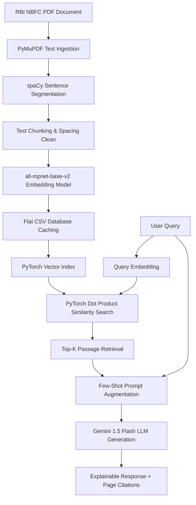

# 🛡️ RBI ReguShield: Regulatory Compliance Local RAG Engine for NBFCs

**RBI ReguShield** is an advanced, production-grade Retrieval-Augmented Generation (RAG) platform designed to automate regulatory compliance queries for Non-Banking Financial Companies (NBFCs) based on the Reserve Bank of India (RBI) Master Directions.

By combining local high-dimensional vector embeddings with semantic retrieval and LLM context synthesis, this application allows compliance officers, risk managers, and fintech developers to query massive central bank directives and receive explainable answers backed by auditable page-level citations.

---

## 🌟 Key Features

- **Semantic Regulations Search**: Uses `all-mpnet-base-v2` (768 dimensions) to create a vector space representation of the RBI Master Directions, allowing semantic search beyond basic keyword matching.
- **Explainable AI with Citations**: Every compliance answer generated is backed by direct text passages and specific PDF page citations, addressing the problem of LLM hallucinations in finance.
- **Fast CPU Caching**: Parses, segments, and embeds the 328-page PDF, then caches the embeddings in a flat database. Subsequent loads of the engine happen in less than 2 seconds on a local CPU.
- **Interactive Compliance Interface**: A premium, dark-mode Streamlit dashboard featuring summary stats (total chunks, embedding metrics), preset sample audit queries, and expandable source segments.
-

---

## 🏗️ System Architecture



---

## ⚙️ Project Setup

### 1. Prerequisites
- Python 3.11.x installed on your local machine.

### 2. Activate Virtual Environment
From the project root directory:

**Windows PowerShell:**
```powershell
.\venv\Scripts\activate.ps1
```

**macOS / Linux:**
```bash
source venv/bin/activate
```

### 3. Install Dependencies
Dependencies are listed in `requirements.txt`:
```bash
pip install -r requirements.txt
```

### 4. Run the Streamlit Application
Start the compliance chat dashboard:
```bash
streamlit run app.py
```
This will launch the web application in your default browser at `http://localhost:8501`.

### 5. Launch the Step-by-Step Notebook
To inspect the code and pipeline steps cell-by-cell:
```bash
jupyter notebook
```


---

## 🛠️ Technical Details & RAG Configuration

- **Embedding Model**: `sentence-transformers/all-mpnet-base-v2`
- **Output Embeddings Dimension**: 768
- **Similarity Metric**: Dot Product / Cosine Similarity
- **Default Retrieval Limit (K)**: 5 passages
- **PDF Document**: *RBI Master Direction - Non-Banking Financial Company – Scale Based Regulation (SBR) Directions, 2023* (328 pages)
